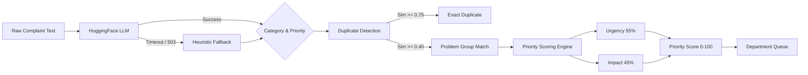

# AI Classification, Deduplication, and Prioritization

The grievance intelligence pipeline transforms unstructured text into prioritized, routed, and aggregated operational workloads.

## 1. Pipeline Flow

## 2. Classification & Routing (LLM-First)

**File:** `services/llm.py`

When a complaint is submitted, it is sent to a HuggingFace Inference API model (e.g., Llama 3 or Mistral).
- The LLM extracts: `department`, `category`, `priority`, and `priority_reasons`.
- **Resilience:** The call has an 8-second hard timeout. If the model returns a 503 (cold start) or times out, the system instantly catches the error and falls back.
- **Validation:** Output is stripped of markdown code fences, parsed as JSON, and strictly validated against the allowed list of 11 departments.

### Heuristic Fallback
**File:** `pipeline/classifier.py`

If the LLM fails, the system tokenizes the text and performs keyword matching against the `department_policies` table. The highest-scoring policy dictates the department and SLA.

## 3. Duplicate Detection & Grouping

**File:** `pipeline/duplicate_detector.py` and `services/problem_grouping.py`

Rather than using semantic embeddings (which require external infrastructure not always available in a hackathon setting), the system uses a deterministic hybrid string-matching algorithm.

**Similarity Formula:**
`Score = (0.80 * Jaccard_Token_Overlap) + (0.20 * SequenceMatcher_Ratio)`

**Thresholds:**
- **Exact Duplicate (`≥ 0.75`):** The complaint is flagged as a literal clone of a previous complaint (`duplicate_of_id`).
- **Problem Group (`≥ 0.40`):** The complaint describes the same real-world issue as an existing active `ProblemGroup`. The complaint is merged into that group, and the group's `affected_users` count increments.
- **Backfill:** If an old, ungrouped complaint matches the new complaint above the `0.40` threshold, it is backfilled into the new group.

## 4. Priority Scoring

The dashboard sorts problems dynamically using a 0-100 `priority_score`. This score is recalculated every time a student joins a group.

**File:** `services/problem_grouping.py`

### Urgency Score (Weight: ~55%)
Based on the individual complaint priority labels (which the LLM assigned based on deadline pressure or safety language).
- Low = 15
- Normal = 40
- High = 70
- Urgent = 95
The group takes the maximum urgency of its member complaints.

### Impact Score (Weight: ~45%)
Based purely on the volume of affected students.
- Formula: `min(100.0, (affected_users / 150.0) * 100.0)`
- *Note: A secondary linear boost `min(100.0, affected_users * 2) * 0.15` is also applied to heavily weight clusters.*

**Final Calculation:**
`priority_score = (urgency_score * 0.45) + (impact_score * 0.40) + (cluster_boost * 0.15)`

This produces an explainable, predictable score where a high-urgency issue affecting 1 person (e.g., "locked out of my room") might score an 80, while a medium-urgency issue affecting 100 people (e.g., "no water in block A") might score a 95.
