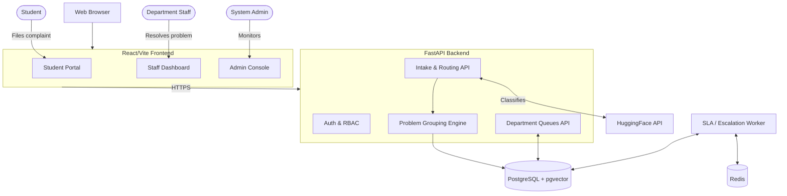

# System Architecture

## 1. Technology Stack

The platform is built as a modular monolith. 

- **Frontend:** React 18 + Vite (Plain JSX). Deployed as a static SPA.
- **Backend API:** FastAPI (Python 3.12). Handles HTTP requests and synchronous AI pipeline execution.
- **Database:** PostgreSQL 16 + pgvector. Serves as the central registry of complaints, problem groups, and audit history.
- **Cache/Queue:** Redis 7.
- **Background Worker:** A lightweight Python polling loop (not Celery or full RQ) for SLA escalation and asynchronous tasks.
- **AI/LLM:** HuggingFace Inference API for text categorization, with a deterministic keyword-based heuristic fallback.
- **Containerization:** Docker Compose for local dev and VM deployment.
- **Proxy:** Caddy (Reverse proxy and automatic HTTPS).

> [!WARNING]
> Previous documentation artifacts (like `24_FINAL_ARCHITECTURE.md`) incorrectly claimed the frontend was Next.js. **The frontend is Vite + React.**

## 2. Component Diagram



## 3. Request Flow & Pipeline Stages

When a complaint is submitted, it goes through a deterministic pipeline to extract intelligence and group it.

```text
app.main:app (HTTP POST /complaints)
  -> app.services.intelligent_intake.build_payload
  -> app.pipeline.orchestrator.analyze_complaint
  -> database commit
```

**Synchronous Pipeline Stages:**
1. **Intake Classification (`services/llm.py`):** Calls HuggingFace to extract Department, Category, and Priority. If the LLM times out (8s) or returns 503, it instantly falls back to keyword-matching (`pipeline/classifier.py`).
2. **Duplicate Detection (`pipeline/duplicate_detector.py`):** Calculates token/sequence similarity against recent complaints. Identifies exact duplicates (≥ 0.75).
3. **Problem Grouping (`services/problem_grouping.py`):** Finds the best matching existing `ProblemGroup` (threshold ≥ 0.40) or creates a new one. Updates the `affected_users` count.
4. **Priority Scoring (`services/problem_grouping.py`):** Calculates a deterministic 0-100 `priority_score` based on urgency (from LLM/SLA) and impact (from affected users).

## 4. Backend Package Structure

The backend (`api/api/`) enforces strict service boundaries:

```text
app/
├── main.py                  # FastAPI app and all route mounting
├── core/                    # Settings, security, logging, constants
├── db/                      # Database session and SQLAlchemy models
├── api/                     # HTTP dependency and route namespaces
│   └── routes/               # health, auth, complaints, admin, etc.
├── schemas/                 # Pydantic request/response shapes
├── services/                # Business-service boundaries (LLM, grouping)
├── pipeline/                # Synchronous complaint analysis logic
│   ├── orchestrator.py      # Runs pipeline stages in order
│   ├── classifier.py        # Keyword heuristic fallback classifier
│   ├── duplicate_detector.py# Token similarity duplicate finder
│   └── policies.py          # Default department config seeder
├── workers/                 # Background polling tasks
│   └── sla_tasks.py         # SLA escalation logic
├── models.py                # Current model implementation (DB tables)
├── rbac.py                  # Role access checks
└── audit.py                 # Audit event persistence
```

## 5. Key Architectural Decisions

- **ProblemGroup vs Complaint:** To solve the "100 students report the same broken pipe" problem, the system uses two layers. `Complaint` is the individual student ticket (immutable history, individual feedback). `ProblemGroup` is the aggregate department operational view. Departments solve the Group, and the solution propagates to all member Complaints.
- **Category Badge Location:** `Complaint.category` is set by the LLM/classifier. `ProblemGroup` does NOT store the category in the DB — it uses a Python `@property` to read it from its member complaints. This avoids schema migrations while surfacing it in the UI.
- **Lightweight Worker:** Instead of Celery (which requires RabbitMQ and heavy dependencies), the background worker is a simple python polling loop running in its own container, using Redis for potential distributed locking or caching.
- **Idempotency:** Repeated "I Have This Problem Too" clicks by the same student for the same active problem are caught and return the existing active complaint ID rather than creating duplicates.
