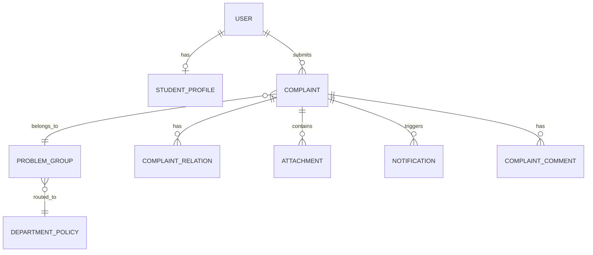

# Data Model

This document describes the actual SQLAlchemy database schema implemented in `api/api/app/models.py`.

## Core Entities & Relationships

The system centers on the relationship between an individual student's **Complaint** and the department's aggregated **Problem Group**.

## 1. Authentication & Users

### `users`
- `id` (Integer, PK)
- `email`, `username`, `hashed_password`
- `role` (student, staff, department_head, admin)
- `department` (Nullable, assigned department for staff)

### `student_profiles`
- `id` (Integer, PK)
- `user_id` (FK -> users.id)
- `full_name`, `department`, `prn_number`, `division`, `roll_no`, `year_semester`, `contact_number`

## 2. Core Grievance Workflow

### `complaints`
The immutable individual record of a student's grievance.
- `id` (UUID string, PK)
- `student_id` (FK -> users.id)
- `problem_group_id` (FK -> problem_groups.id) — Links to the core problem.
- `department`, `category`, `subcategory`, `title`, `description`
- `status` (open, in_progress, resolved, closed, escalated)
- `priority` (low, normal, high, urgent)
- `classification_confidence`, `priority_reasons` (JSON)
- `affected_users` (synchronized with the parent problem group)
- `sla_due_at`, `duplicate_of_id`
- `solution_text`, `solution_by_id`, `solution_at`
- `feedback_accepted`, `feedback_comment`, `feedback_at`

### `problem_groups`
The department-facing aggregated workload. Many complaints can point to one problem group.
- `id` (UUID, PK)
- `problem_code` (String, e.g. `PROB-A1B2C3D4`)
- `title`, `description`, `department`
- `complaint_count`, `affected_users`
- `urgency_score`, `impact_score`, `priority_score` (0-100 values driving the queue sort)
- `priority`, `status`
- `solution_text`, `solution_by_id`, `solution_at`

## 3. Classification & Intelligence

### `department_policies`
Used by the heuristic fallback classifier to map keywords to departments.
- `id` (Integer, PK)
- `name` (String, e.g. Hostel, CSE, AIML, CSBS, Mechanical, Electrical, ENTC, Biotech, Exam Cell, Canteen, General Review)
- `category`
- `keywords` (JSON array)
- `sla_hours` (Integer, default 48)

### `complaint_relations`
Stores the results of the duplicate detection engine.
- `id` (Integer, PK)
- `source_complaint_id`, `target_complaint_id`
- `relation_type` (e.g. "duplicate", "related")
- `similarity_score` (Float)
- `explanation`

### `complaint_embeddings`
Stores semantic embeddings for future LLM integration.
- `id` (Integer, PK)
- `complaint_id` (FK -> complaints.id)
- `embedding` (VectorType - 1536 dim pgvector, falls back to JSONB if pgvector unavailable)

## 4. Communication & Audit

### `notifications`
- `id` (Integer, PK)
- `user_id`, `complaint_id`
- `channel` (e.g. "in_app", "email"), `recipient`, `subject`, `body`

### `messages` & `complaint_comments`
- Chat and commenting interfaces for complaints (Sender, Recipient, Body, IsRead).

### `audit_logs`
Immutable ledger of lifecycle changes.
- `id` (Integer, PK)
- `actor_id`
- `action` (e.g. "complaint.solution.provided")
- `entity_type`, `entity_id`
- `event_metadata` (JSON)

### `idempotency_keys`
- Stores request hashes and response payloads to prevent duplicate submissions via API retries.
